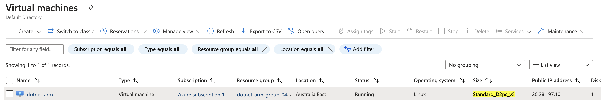
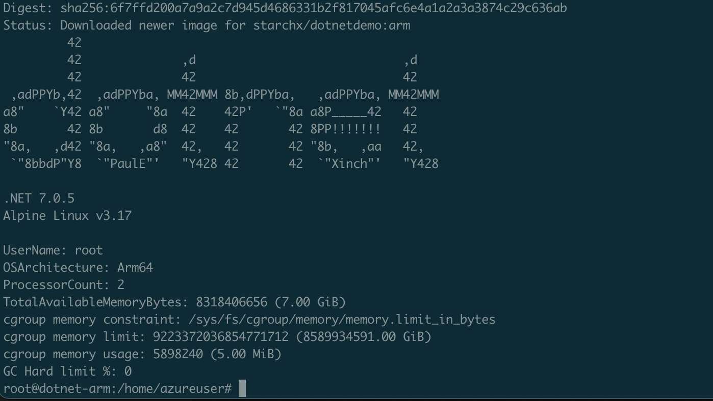
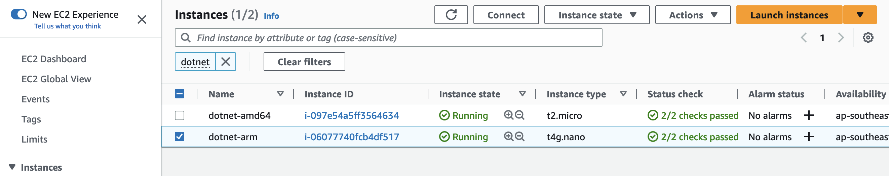
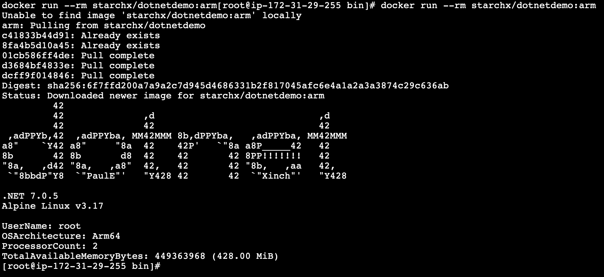
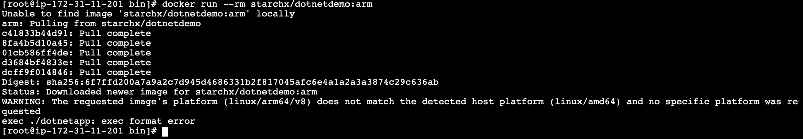

# DotNet Demo App to run on Azure Ampere® Altra® VM and AWS Graviton Instance

## Container Image

Base image is DotNet `7.0-alpine-arm64v8`.

Build image using ARM based (e.g. Macbook M1)

```bash
# change docker hub login for your own
docker build -t starchx/dotnetdemo:arm .
```

Run:

```bash
docker run --rm starchx/dotnetdemo:arm
```

## Test Run on Azure and AWS

Ampere® Altra® VM size in the demo: [Standard_D2ps_v5](https://learn.microsoft.com/en-us/azure/virtual-machines/dpsv5-dpdsv5-series)





AWS Graviton instance in the demo: [t4g.nano](https://aws.amazon.com/ec2/instance-types/t4/)





Will fail when running on AMD64 arch instance:



## Reference

https://github.com/dotnet/dotnet-docker/tree/main/samples/dotnetapp
